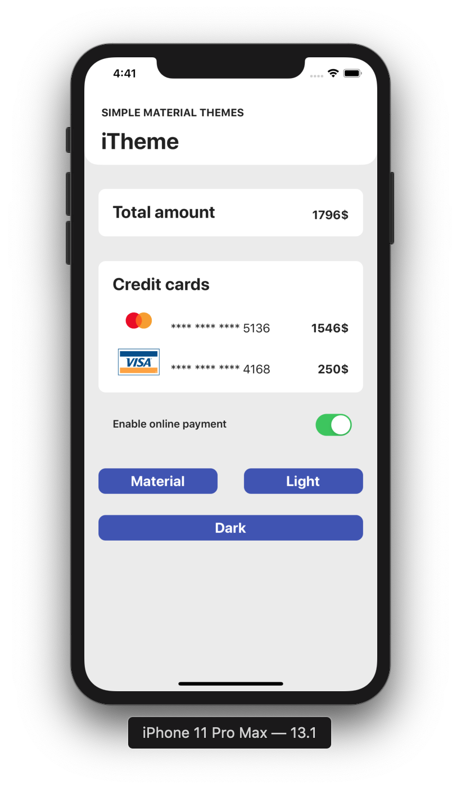
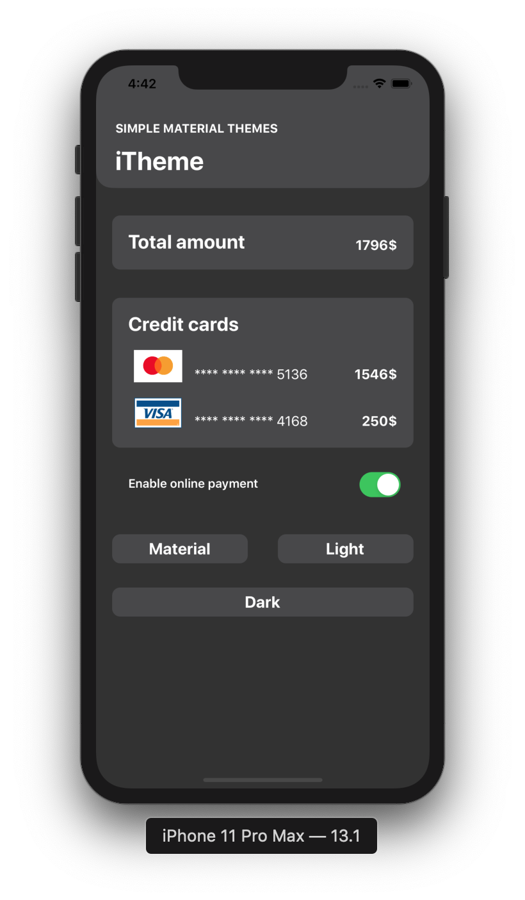
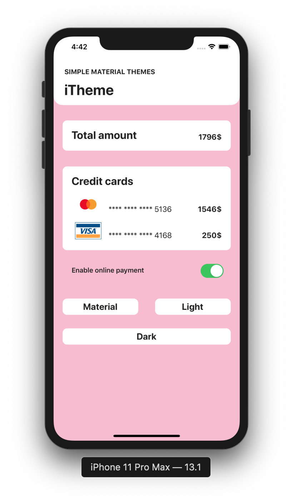

# iTheme
iTheme is a simple Theme manager. You can easily:
 - [x] switch between different themes
 - [x] add/modify themes
 - [x] automatically store the last selected theme 
<p align="center">
  
  
  
</p>

<h2>Peek a color</h2>

```swift
self.view.backgroundColor = ITheme.backgroundColor
self.description.textColor = ITheme.subtitle
```

<h2>Set gradient background</h2>

```swift
ITheme.setGradientBackground(self.view)
```

<h2>Add a new theme</h2>
To add a new theme, just add the name of your brand new theme in the
(String => func()) dictionnary:

```swift
fileprivate static let themes =
[
    "light": light,
    "dark": dark,
    "material": material
    "myCoolTheme": myCoolTheme
    ...
]
```

Then, you must implement the function associated to your theme like this:

```swift
static let myCoolTheme: () -> () = {
    loadPalette(lightPal)
    saveTheme("myCoolTheme")
}
```

The loadPalette() method will load your theme colors defined in a specific array:


```swift
fileprivate static let lightPal =
[
    UIColor(rgb: 0x3F51B5), UIColor(rgb: 0xFFFFFF), UIColor(rgb: 0xebebeb),
    UIColor(rgb: 0xFFFFFF), UIColor(rgb: 0x212121), UIColor(rgb: 0x212121),
    UIColor(rgb: 0x212121)
]
fileprivate static let darkPal = [...]
fileprivate static let materialPal = [...]
...
```

Finally, saveTheme() stores the name of your theme in the UserDefaults of the iOS device.
Thus, the user can fetch the last used theme even if the app is closed and restarted.
